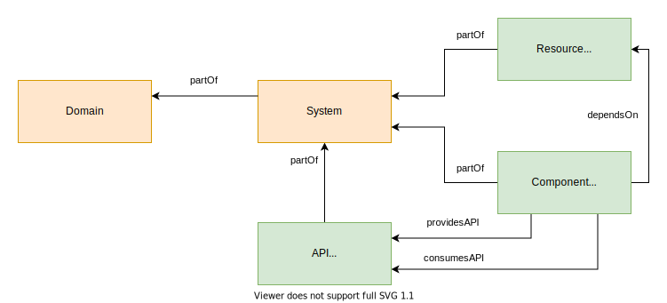

# Backstage Software Catalog #

## What is the software catalog? ##

The Backstage Software Catalog is the description of all the software in the ecosystem of a development team. By software we mean libraries, services, websites, databases, APIs, etc. It keep track of ownership, metadata and dependencies between all the software entities. Within backstage API the catalog is represented in a json form but developers will use YAML to describe the different entities of the catalog in their own repos.

## Software Catalog Data Model ##



## Entity kinds and usage ##

There are different _kinds_ of _entities_

The YAML file describing the entities are made of several fields/parts. Some are common to all kinds, other are required for specific kinds, some are optionals. The model is extendable but there are some caveats. It require using a different version of api that might break compatibility with backstage and/or third party plugins. If we feel we have a strong need to introduce a new kind, it might be useful to discuss it with upstream first so that it can be included in the upstream api.

See the [Backstage YAML File Format reference](https://backstage.io/docs/features/software-catalog/descriptor-format) and the links below.

## Anatomy of a YAML catalog file ##

The skeleton of a catalog file comprise several mandatory fields in the main _envelope_

1. The apiVersion
2. kind
3. metadata
3. spec

## apiVersion field ##

Backtage upstream project maintain its apiVersion set of kinds. Until further upstream change and unless you want to use a different set of kinds thant the one provided by the upstream backstage project, it should always be the following:

`apiVersion: backstage.io/v1alpha1`

## kind field ##

Using `backstage.io/v1alpha1` apiVersion, it is to be chosen between the following:
- User
- Group
- Domain
- System
- Component
- Resource
- api
- Location

See the table of [kinds](#The-Kinds) below

example:
`kind: Component`

## metadata field ##

The metadata field must include the mandatory **name** subfield. Other optional fields include:
- description
- title: replace name in the interface if set with less stringent format
- namespace: reserved for future use, recommended not to be used for now
- labels: similar to Kubernetes labels, mostly currently unused
- annotations: similar to Kubernetes, mainly used to reference external systems for plugins connection
- tags: single words mostly used to filter entities in the interface 
- links: to be used with external hyperlinks related to the entity

example:

```
metadata:
  name: remarkjs
  description: A simple, in-browser, markdown-driven slideshow tool.
  tags:
    - javacript
    - markdown
    - slideshow
  links:
    - https://remarkjs.com
    - https://github.com/gnab/remark
```

## spec field ##

The spec field is mandatory but the required subfields vary depending on the kind.
```
spec:
  owner: me
  status: production
  dependsOn: something-else
```

## The Kinds ##

| Kinds      | Description                                                                                      | Reference link |
| ---------- | ------------------------------------------------------------------------------------------------ | -------------- |
| User       | This is used to define individual users or development teams members. Useful to track down ownership of software entities. | [kind-user](https://backstage.io/docs/features/software-catalog/descriptor-format#kind-user) |
| Group      | This is used to define development teams. Useful to track down ownership of software entities. | [kind-group](https://backstage.io/docs/features/software-catalog/descriptor-format#kind-group) |
| Component  | A Component describes a software component, which could be of any type:<br>- service<br>- library<br>- website<br>- faas function<br>- anything else, types are extendables.<br><br>Components would refer either to entities that have a distinct deployment or that are maintained separately. | [kind-component](https://backstage.io/docs/features/software-catalog/descriptor-format#kind-component) |
| API  | An interface exposed by a component. Type can be anything but is important as backstage will use the appropriate viewer for the format.<br><br>well known and supported values are:<br>- `openapi`<br>- `asyncapi`<br>- `graphql`<br>- `grpc`  | [kind-api](https://backstage.io/docs/features/software-catalog/descriptor-format#kind-api) |
| Resource  | Describes an infrastructure used by components. Examples:<br>- databases<br>- storage buckets<br>- CDN<br>- pub/sub service<br>- message queue | [kind-resource](https://backstage.io/docs/features/software-catalog/descriptor-format#kind-resource) |
| System     | A collection of components that exposes one or several APIs and provide one or several functions. Ideally a system consist of only a handful of components | [kind-system](https://backstage.io/docs/features/software-catalog/descriptor-format#system) |
| Domain     | A Domain is a collection of system. It can either identify individual products or if the backstage instance is dedicated to a specific product it can group systems that share the same business purpose.| [kind-domain](https://backstage.io/docs/features/software-catalog/descriptor-format#domain) |
| Location   | A location is a reference to other catalog files| [kind-domain](https://backstage.io/docs/features/software-catalog/descriptor-format#kind-location) |


