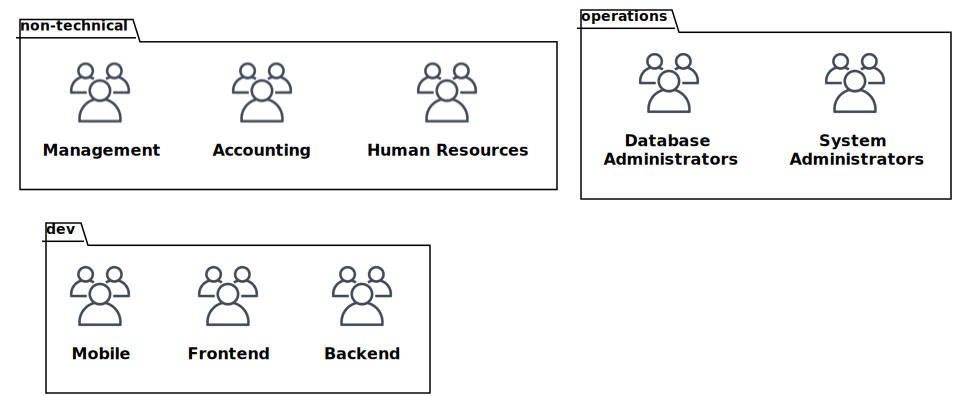
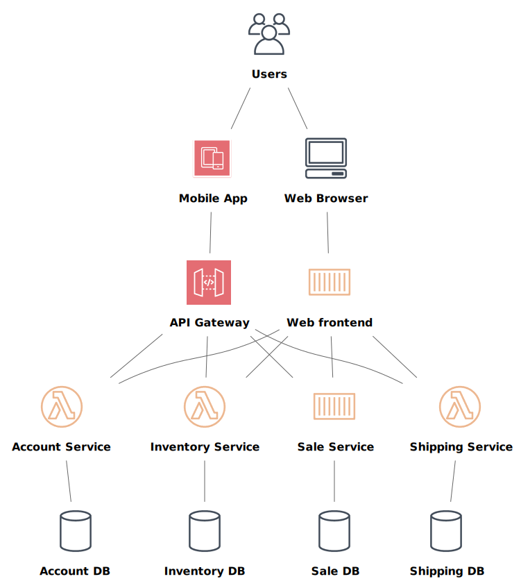
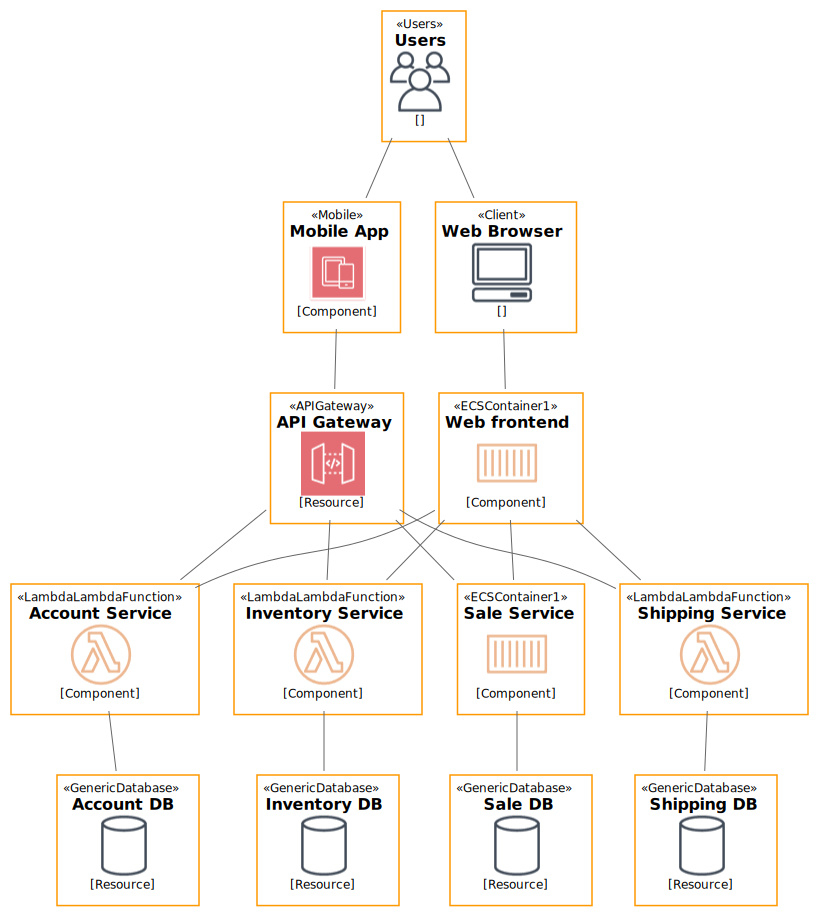
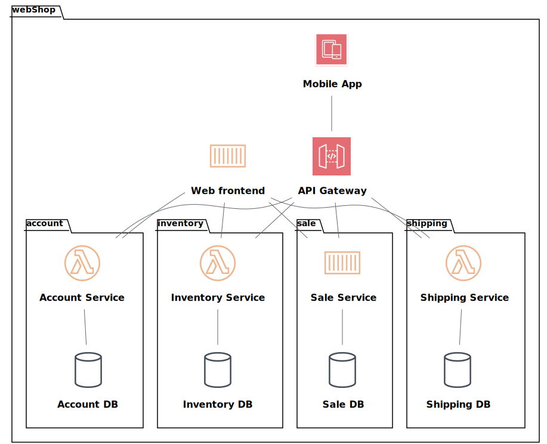

# Building a catalog #

## Our example company ##

Our example company Acme Corp

<!---
<div hidden>
```
@startuml ch2-organigram
!include <awslib/AWSCommon>
!include <awslib/AWSSimplified.puml>
!include <awslib/Compute/all.puml>
!include <awslib/mobile/all.puml>
!include <awslib/general/all.puml>
!include <awslib/GroupIcons/all.puml>

package non-technical {
  Users(management,"Management","management@acme.corp")
  Users(accounting,"Accounting","Accounting@acme.corp")
  Users(hr,"Human Resources","hr@acme.corp")
}

package dev {
  Users(mobiledev,"Mobile","dev.mobile@acme.corp")
  Users(frontenddev,"Frontend","dev.frontend@acme.corp")
  Users(backenddev,"Backend","dev.backend@acme.corp")
}

package operations {
  Users(opdba,"Database Administrators","op.dba@acme.corp")
  Users(opsys,"System Administrators","op.sys@acme.corp")
}

management -[hidden]r- accounting
accounting -[hidden]r- hr
management -[hidden]d- mobiledev
mobiledev -[hidden]r- frontenddev
frontenddev -[hidden]r- backenddev
opdba -[hidden]r- opsys

@enduml
```
</div>
--->



## Our example architecture ##

Here is an example of the architecture of a webshop.

<!---
<div hidden>
```
@startuml ch2-architecture-diagram
!include <awslib/AWSCommon>
!include <awslib/AWSSimplified.puml>
!include <awslib/Compute/all.puml>
!include <awslib/mobile/all.puml>
!include <awslib/general/all.puml>

'skinparam linetype ortho

Users(Users, "Users", "")
Mobile(MobileApp, "Mobile App", "")
Client(Browser, "Web Browser", "")
GenericDatabase(AccountDB, "Account DB", "")
GenericDatabase(InventoryDB, "Inventory DB", "")
GenericDatabase(SaleDB, "Sale DB", "")
GenericDatabase(ShippingDB, "Shipping DB", "")
ECSContainer1(WebApp, "Web frontend", "")
APIGateway(APIgw, "API Gateway", "")
LambdaLambdaFunction(Accountsvc, "Account Service", "")
LambdaLambdaFunction(Inventorysvc, "Inventory Service", "")
LambdaLambdaFunction(Shippingsvc, "Shipping Service", "")
ECSContainer1(Salesvc, "Sale Service", "")

MobileApp -[hidden]r- Browser
APIgw -[hidden]r- WebApp
Accountsvc -[hidden]r- Inventorysvc
Inventorysvc -[hidden]r- Salesvc
Salesvc -[hidden]r- Shippingsvc
AccountDB -[hidden]r- InventoryDB
InventoryDB -[hidden]r- SaleDB
SaleDB -[hidden]r- ShippingDB

Users -- MobileApp
Users -- Browser
MobileApp -- APIgw
Browser -- WebApp
APIgw -- Accountsvc
WebApp -- Accountsvc
APIgw -- Inventorysvc
WebApp -- Inventorysvc
APIgw -- Salesvc
WebApp -- Salesvc
APIgw -- Shippingsvc
WebApp -- Shippingsvc
Accountsvc -- AccountDB
Inventorysvc -- InventoryDB
Shippingsvc -- ShippingDB
Salesvc -- SaleDB

@enduml
```
</div>
--->



## Our catalog repo ##

Let's create the repository of our catalog.

At the root, we want a `catalog-info.yaml` file that will serve to host the main _domain_ as well as a _location_ kind to point to other catalog yaml files.

We will start with the following subdirectories and catalog file structure:
```
./org-data/organization.yaml # will store main organization group as well as location to target the other groups
./org-data/<business-unit-names>/<team-name>.yaml #will store group and user catalog kinds
./products/<product-name>/<system-name>.yaml #will store system, components and resources kinds
```

Note: in real life example we would point to a catalog file embedded in each individual product or resource repo.

## Organization skeleton ##

The root catalog file of our organization. We could technically fill the (mandatory) children field of our organization but it is easier to use the parent field of the sub groups. Note the extensive use of wildcards to ease up our process but in real life example you would point to catalog files of your respective repos.

```
apiVersion: backstage.io/v1alpha1
kind: Group
metadata:
  name: acme
  title: ACME corp
spec:
  type: organization
  children: []
---
apiVersion: backstage.io/v1alpha1
kind: Location
metadata:
  name: teams
spec:
  targets:
    - ./org-data/*/catalog-info.yaml
    - ./products/*/*.yaml
```

Then we can create our other groups in ./org-data/dev/catalog-info.yaml and ./teams/operations/catalog-info.yaml, using `type: business unit` for the operations and dev and `type: team` for dev and operationnal teams. Don't forget to fill the parent field. We can also create user and add them as member of your teams, using the right column of the [descriptor format page](https://backstage.io/docs/features/software-catalog/descriptor-format) to guide us with the required fields. We will build the domain later after reviewing the architecture of our example project.

## Identifying components and resources ##

The Webshop as a whole is a system. End users and Browser are not software entities of our webshop product, we will ignore them in the next parts.
DB and amazon api gateway are resources, as the code is not managed by a development team.
All others entities are components.

<!---
<div hidden>
```
@startuml ch2-components-resources
!include <awslib/AWSCommon>
!include <awslib/Compute/all.puml>
!include <awslib/mobile/all.puml>
!include <awslib/general/all.puml>

'skinparam linetype ortho

Users(Users, "Users", "")
Mobile(MobileApp, "Mobile App", "Component")
Client(Browser, "Web Browser", "")
GenericDatabase(AccountDB, "Account DB", "Resource")
GenericDatabase(InventoryDB, "Inventory DB", "Resource")
GenericDatabase(SaleDB, "Sale DB", "Resource")
GenericDatabase(ShippingDB, "Shipping DB", "Resource")
ECSContainer1(WebApp, "Web frontend", "Component")
APIGateway(APIgw, "API Gateway", "Resource")
LambdaLambdaFunction(Accountsvc, "Account Service", "Component")
LambdaLambdaFunction(Inventorysvc, "Inventory Service", "Component")
LambdaLambdaFunction(Shippingsvc, "Shipping Service", "Component")
ECSContainer1(Salesvc, "Sale Service", "Component")

MobileApp -[hidden]r- Browser
APIgw -[hidden]r- WebApp
Accountsvc -[hidden]r- Inventorysvc
Inventorysvc -[hidden]r- Salesvc
Salesvc -[hidden]r- Shippingsvc
AccountDB -[hidden]r- InventoryDB
InventoryDB -[hidden]r- SaleDB
SaleDB -[hidden]r- ShippingDB

Users -- MobileApp
Users -- Browser
MobileApp -- APIgw
Browser -- WebApp
APIgw -- Accountsvc
WebApp -- Accountsvc
APIgw -- Inventorysvc
WebApp -- Inventorysvc
APIgw -- Salesvc
WebApp -- Salesvc
APIgw -- Shippingsvc
WebApp -- Shippingsvc
Accountsvc -- AccountDB
Inventorysvc -- InventoryDB
Shippingsvc -- ShippingDB
Salesvc -- SaleDB

@enduml
```
</div>
--->


 
## Creating our first Components ##

Types are dynamically expandable we'll make use of that to easily filter out compnents

```
apiVersion: backstage.io/v1alpha1
kind: Component
metadata:
  name: webapp
  title: Webshop Frontend
spec:
  type: website
  owner: frontend
```

```
apiVersion: backstage.io/v1alpha1
kind: Component
metadata:
  name: Accountsvc
  title: Account Service
spec:
  type: service
  owner: backend
```

## Creating our first resources ##

Here we will define our resources, here is an example of it.
Note that the owner is the backend team, who uses the resource, instead of the operationnal team (dba) that might do the operationnal management.

```
apiVersion: backstage.io/v1alpha1
kind: Resource
metadata:
  name: AccountDB
  title: Account Database
spec:
  type: Postgresql-database
  owner: backend
```

## System and Domain ##

Our Domain will comprise the entire webshop as it is our project. But we should also use it as a systemas it comprise different entities such as the web frontend, the API GW and Mobile App. We can separate the Account, Inventory, Sale and Shipping logical functions as separate systems.

<!---
<div hidden>
```
@startuml ch2-system-domain
!include <awslib/AWSCommon>
!include <awslib/AWSSimplified.puml>
!include <awslib/Compute/all.puml>
!include <awslib/mobile/all.puml>
!include <awslib/general/all.puml>
!include <awslib/GroupIcons/all.puml>
!include <awslib/Storage/all.puml>
!include <awslib/ManagementAndGovernance/all.puml>
!include <awslib/CustomerEngagement/all.puml>
!include <awslib/MachineLearning/all.puml>
!include <awslib/NetworkingAndContentDelivery/all.puml>
!include <awslib/Database/all.puml>
!include <awslib/ApplicationIntegration/all.puml>

'skinparam linetype ortho

Package webShop {
  Mobile(MobileApp, "Mobile App", "Component")
  Package account {
    LambdaLambdaFunction(Accountsvc, "Account Service", "Component")
    GenericDatabase(AccountDB, "Account DB", "Resource")
  }
  Package inventory {
    LambdaLambdaFunction(Inventorysvc, "Inventory Service", "Component")
    GenericDatabase(InventoryDB, "Inventory DB", "Resource")
  }
  Package sale {
    ECSContainer1(Salesvc, "Sale Service", "Component")
    GenericDatabase(SaleDB, "Sale DB", "Resource")
  }
  Package shipping {
    LambdaLambdaFunction(Shippingsvc, "Shipping Service", "Component")
    GenericDatabase(ShippingDB, "Shipping DB", "Resource")
  }
  
  ECSContainer1(WebApp, "Web frontend", "Component")
  APIGateway(APIgw, "API Gateway", "Resource")
}

APIgw -[hidden]l- WebApp
Accountsvc -[hidden]r- Inventorysvc
Inventorysvc -[hidden]r- Salesvc
Salesvc -[hidden]r- Shippingsvc
AccountDB -[hidden]r- InventoryDB
InventoryDB -[hidden]r- SaleDB
SaleDB -[hidden]r- ShippingDB

MobileApp -- APIgw
APIgw -- Accountsvc
WebApp -- Accountsvc
APIgw -- Inventorysvc
WebApp -- Inventorysvc
APIgw -- Salesvc
WebApp -- Salesvc
APIgw -- Shippingsvc
WebApp -- Shippingsvc
Accountsvc -- AccountDB
Inventorysvc -- InventoryDB
Shippingsvc -- ShippingDB
Salesvc -- SaleDB

@enduml
```
</div>
--->


## Domain example ##

```
apiVersion: backstage.io/v1alpha1
kind: Domain
metadata:
  name: webshop
spec:
  owner: dev
```

## System example ##

```
apiVersion: backstage.io/v1alpha1
kind: System
metadata:
  name: mobile
spec:
  owner: mobile
```

